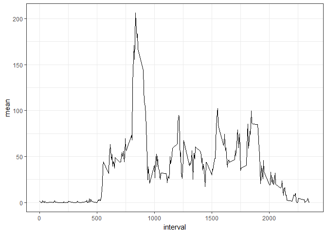

============

Loading and preprocessing the data
----------------------------------

Load packages and read data.

    library(tidyverse)

    ## Loading tidyverse: ggplot2
    ## Loading tidyverse: tibble
    ## Loading tidyverse: tidyr
    ## Loading tidyverse: readr
    ## Loading tidyverse: purrr
    ## Loading tidyverse: dplyr

    ## Conflicts with tidy packages ----------------------------------------------

    ## filter(): dplyr, stats
    ## lag():    dplyr, stats

    activity <- read_csv("H:/Kurse/DataScience/ReproducibleResearch/Assignment1/activity.csv", col_types = cols(steps = col_number()))

What is mean total number of steps taken per day?
-------------------------------------------------

Group by date and calculate sum of steps per day

    sum_steps <- activity %>% group_by(date) %>% summarise (sum = sum (steps))

Make a histogram of the sum of steps per day

    hist(sum_steps$sum)

Calculate the mean and median steps per day

    sum_steps %>% group_by(date) %>% summarise (mean = mean(sum), median = median (sum, na.rm = TRUE))

    ## # A tibble: 61 × 3
    ##          date  mean median
    ##        <date> <dbl>  <dbl>
    ## 1  2012-10-01    NA     NA
    ## 2  2012-10-02   126    126
    ## 3  2012-10-03 11352  11352
    ## 4  2012-10-04 12116  12116
    ## 5  2012-10-05 13294  13294
    ## 6  2012-10-06 15420  15420
    ## 7  2012-10-07 11015  11015
    ## 8  2012-10-08    NA     NA
    ## 9  2012-10-09 12811  12811
    ## 10 2012-10-10  9900   9900
    ## # ... with 51 more rows

What is the average daily activity pattern?
-------------------------------------------

Make a time series plot (i.e. type = "l") of the 5-minute interval
(x-axis) and the average number of steps taken, averaged across all days
(y-axis)

Calculate the mean of steps per interval across all days
========================================================

    intervals <- activity %>% group_by(interval) %>% summarise (mean=mean(steps, na.rm = TRUE))

    ggplot(intervals, aes(x =  interval, y = mean)) +
      geom_line() +
      theme_bw()

Which 5-minute interval, on average across all the days in the dataset,
contains the maximum number of steps?

    intervals %>% arrange(desc(mean))

    ## # A tibble: 288 × 2
    ##    interval     mean
    ##       <int>    <dbl>
    ## 1       835 206.1698
    ## 2       840 195.9245
    ## 3       850 183.3962
    ## 4       845 179.5660
    ## 5       830 177.3019
    ## 6       820 171.1509
    ## 7       855 167.0189
    ## 8       815 157.5283
    ## 9       825 155.3962
    ## 10      900 143.4528
    ## # ... with 278 more rows

Imputing missing values
-----------------------

Calculate NAs

    sum(is.na(activity$steps))

    ## [1] 2304

Devise a strategy for filling in all of the missing values in the
dataset. The strategy does not need to be sophisticated. For example,
you could use the mean for that 5-minute interval. Create a new dataset
that is equal to the original dataset but with the missing data filled
in.

    activity_imputed <- activity %>% group_by(interval) %>% mutate(steps = replace(steps, is.na(steps), mean(steps, na.rm=TRUE)))
    sum(is.na(activity_imputed$steps))

    ## [1] 0

Make a histogram of the total number of steps taken each day and
Calculate and report the mean and median total number of steps taken per
day. Do these values differ from the estimates from the first part of
the assignment? What is the impact of imputing missing data on the
estimates of the total daily number of steps?

    sum_steps2 <- activity_imputed %>% group_by(date) %>% summarise (sum = sum (steps))
    hist(sum_steps2$sum)

Answer: Imputing changes results significantly.

Are there differences in activity patterns between weekdays and weekends?
-------------------------------------------------------------------------

Create a new factor variable in the dataset with two levels – “weekday”
and “weekend” indicating whether a given date is a weekday or weekend
day.

    activity_imputed <- activity_imputed %>% mutate(date, Weekday = weekdays(date))
    activity_imputed <- activity_imputed %>% mutate(Weekday = ifelse(Weekday == "Sonntag" | Weekday == "Samstag", "Weekend", "Workday"))

Make a panel plot containing a time series plot (i.e. type = "l") of the
5-minute interval (x-axis) and the average number of steps taken,
averaged across all weekday days or weekend days (y-axis).

    interval2 <- activity_imputed %>% group_by(Weekday, interval) %>% summarise (mean = mean (steps))

    ggplot(interval2, aes ( x = interval, y = mean, color = Weekday)) +
             geom_line(size = 0.8) +
             facet_wrap(~Weekday, ncol = 1, nrow=2) +
             theme_bw()

